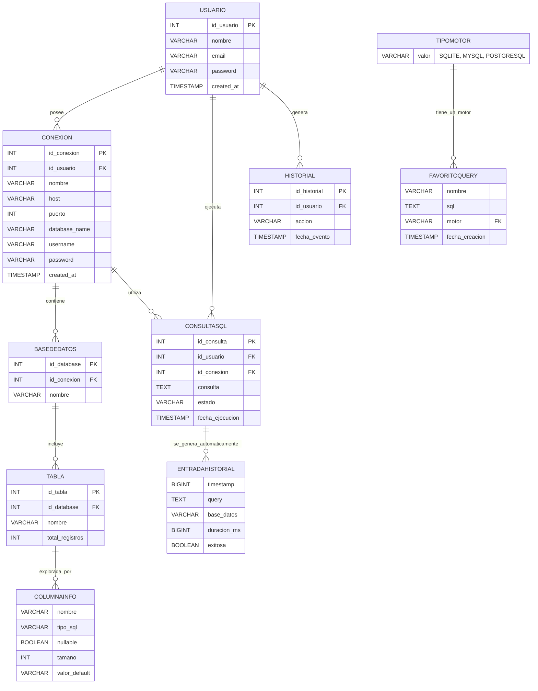

# Modelo de Datos - Estante

## 1. Visión General

Estante es un gestor de bases de datos desarrollado en Java con JavaFX que permite conectarse, explorar y administrar bases de datos MySQL mediante una interfaz gráfica.

El sistema permite gestionar conexiones, ejecutar consultas SQL y explorar estructuras de bases de datos de forma visual e intuitiva.

El presente documento describe el modelo entidad-relación (ER) principal del sistema.

---

# 2. Entidades y Atributos

## 2.1. Usuario

Representa a los usuarios que utilizan el sistema.

| Atributo | Tipo | Descripción |
|---|---|---|
| id_usuario | INT | Identificador único |
| nombre | VARCHAR | Nombre del usuario |
| email | VARCHAR | Correo electrónico |
| password | VARCHAR | Contraseña cifrada |
| created_at | TIMESTAMP | Fecha de creación |

### Claves

- PK: `id_usuario`

---

## 2.2. Conexion

Representa una conexión configurada hacia un servidor MySQL.

| Atributo | Tipo | Descripción |
|---|---|---|
| id_conexion | INT | Identificador único |
| id_usuario | INT | Usuario propietario |
| nombre | VARCHAR | Nombre descriptivo |
| host | VARCHAR | Dirección del servidor |
| puerto | INT | Puerto de conexión |
| database_name | VARCHAR | Base de datos seleccionada |
| username | VARCHAR | Usuario MySQL |
| password | VARCHAR | Contraseña cifrada |
| created_at | TIMESTAMP | Fecha de creación |

### Claves

- PK: `id_conexion`
- FK: `id_usuario -> Usuario.id_usuario`

---

## 2.3. BaseDeDatos

Representa una base de datos accesible desde una conexión.

| Atributo | Tipo | Descripción |
|---|---|---|
| id_database | INT | Identificador único |
| id_conexion | INT | Conexión asociada |
| nombre | VARCHAR | Nombre de la base de datos |

### Claves

- PK: `id_database`
- FK: `id_conexion -> Conexion.id_conexion`

---

## 2.4. Tabla

Representa tablas existentes dentro de una base de datos.

| Atributo | Tipo | Descripción |
|---|---|---|
| id_tabla | INT | Identificador único |
| id_database | INT | Base de datos asociada |
| nombre | VARCHAR | Nombre de la tabla |
| total_registros | INT | Cantidad de registros |

### Claves

- PK: `id_tabla`
- FK: `id_database -> BaseDeDatos.id_database`

---

## 2.5. ConsultaSQL

Representa consultas SQL ejecutadas por el usuario.

| Atributo | Tipo | Descripción |
|---|---|---|
| id_consulta | INT | Identificador único |
| id_usuario | INT | Usuario que ejecuta |
| id_conexion | INT | Conexión utilizada |
| consulta | TEXT | Sentencia SQL |
| estado | VARCHAR | Resultado de ejecución |
| fecha_ejecucion | TIMESTAMP | Fecha de ejecución |

### Claves

- PK: `id_consulta`
- FK: `id_usuario -> Usuario.id_usuario`
- FK: `id_conexion -> Conexion.id_conexion`

---

## 2.6. Historial

Registra eventos y operaciones realizadas dentro del sistema.

| Atributo | Tipo | Descripción |
|---|---|---|
| id_historial | INT | Identificador único |
| id_usuario | INT | Usuario asociado |
| accion | VARCHAR | Acción realizada |
| fecha_evento | TIMESTAMP | Fecha del evento |

### Claves

- PK: `id_historial`
- FK: `id_usuario -> Usuario.id_usuario`

---

## 2.7. FavoritoQuery

Representa una consulta SQL guardada como favorita por el usuario para reutilizarla. Se implementa como un `record` inmutable (`edu.sisinf.estante.modelo.FavoritoQuery`).

| Atributo | Tipo | Descripción |
|---|---|---|
| nombre | VARCHAR | Nombre descriptivo asignado al favorito |
| sql | TEXT | Sentencia SQL guardada |
| motor | VARCHAR | Motor de base de datos al que corresponde la consulta (relacionado con `TipoMotor`) |
| fecha_creacion | TIMESTAMP | Fecha de creación del favorito |

### Claves

- No tiene identificador propio en el modelo actual (objeto de valor inmutable).
- Relación lógica: `motor -> TipoMotor` (valor textual correspondiente a uno de los valores del enum `TipoMotor`: `SQLITE`, `MYSQL`, `POSTGRESQL`).

### Validaciones

- `nombre` no puede ser nulo ni estar vacío.
- `sql` no puede ser nulo ni estar vacío.
- `motor` no puede ser nulo ni estar vacío.
- Si no se especifica `fecha_creacion`, se asigna automáticamente la fecha y hora actuales.

---

## 2.8. EntradaHistorial

Registra una query ejecutada durante la sesión, incluyendo su resultado y rendimiento. Se implementa como un `record` inmutable (`edu.sisinf.estante.modelo.EntradaHistorial`).

| Atributo | Tipo | Descripción |
|---|---|---|
| timestamp | BIGINT | Momento de ejecución de la query (epoch en milisegundos) |
| query | TEXT | Sentencia SQL ejecutada |
| base_datos | VARCHAR | Nombre de la base de datos o conexión activa al momento de ejecutar |
| duracion_ms | BIGINT | Tiempo de ejecución de la query, en milisegundos |
| exitosa | BOOLEAN | Indica si la query se ejecutó sin errores |

### Claves

- No tiene identificador propio en el modelo actual (objeto de valor inmutable).
- No posee FK explícita: a diferencia de `Historial` (que se asocia a un `Usuario`), `EntradaHistorial` se genera automáticamente por el sistema cada vez que se ejecuta una consulta, sin intervención manual del usuario.

### Notas

- A diferencia de `ConsultaSQL` y `Historial`, que el usuario crea o consulta explícitamente, `EntradaHistorial` es producida automáticamente por el motor de ejecución de queries como subproducto de cada ejecución.

---

## 2.9. ColumnaInfo

Representa la metadata de una columna de una tabla, obtenida en tiempo real desde el motor de base de datos mediante JDBC (`DatabaseMetaData`). Se implementa como un `record` inmutable (`edu.sisinf.estante.modelo.ColumnaInfo`).

| Atributo | Tipo | Descripción |
|---|---|---|
| nombre | VARCHAR | Nombre de la columna |
| tipo_sql | VARCHAR | Tipo de dato SQL reportado por el motor (`TYPE_NAME`) |
| nullable | BOOLEAN | Indica si la columna admite valores nulos |
| tamano | INT | Tamaño/longitud de la columna (puede ser nulo si el motor no lo reporta) |
| valor_default | VARCHAR | Valor por defecto de la columna, si existe |

### Claves

- No tiene identificador propio ni se persiste en base de datos propia: es un objeto de valor calculado al vuelo.
- Relación lógica: `ColumnaInfo` es producido por `ExploradorEsquemas.getColumnas(Connection, tabla)`, que consulta los metadatos JDBC de una `Tabla` y construye una lista de `ColumnaInfo` por cada columna encontrada.

### Notas

- Esta entidad no proviene de una tabla propia del sistema, sino que se construye dinámicamente a partir de los metadatos de la base de datos externa a la que el usuario se conecta.

---

# 3. Relaciones entre Entidades

## Usuario → Conexion

- Un usuario puede registrar múltiples conexiones.
- Cada conexión pertenece a un único usuario.

**Cardinalidad:** `1:N`

---

## Conexion → BaseDeDatos

- Una conexión puede contener múltiples bases de datos.
- Cada base de datos pertenece a una única conexión.

**Cardinalidad:** `1:N`

---

## BaseDeDatos → Tabla

- Una base de datos puede contener múltiples tablas.
- Cada tabla pertenece a una única base de datos.

**Cardinalidad:** `1:N`

---

## Usuario → ConsultaSQL

- Un usuario puede ejecutar múltiples consultas SQL.
- Cada consulta pertenece a un único usuario.

**Cardinalidad:** `1:N`

---

## Conexion → ConsultaSQL

- Una conexión puede utilizarse en múltiples consultas.
- Cada consulta utiliza una única conexión.

**Cardinalidad:** `1:N`

---

## Usuario → Historial

- Un usuario puede generar múltiples eventos.
- Cada evento pertenece a un único usuario.

**Cardinalidad:** `1:N`

---

## TipoMotor → FavoritoQuery

- Un favorito guardado tiene siempre un motor de base de datos asociado (campo `motor`, con los valores del enum `TipoMotor`: `SQLITE`, `MYSQL`, `POSTGRESQL`).
- Un mismo motor puede estar asociado a múltiples favoritos guardados.

**Cardinalidad:** `1:N`

---

## Sistema → EntradaHistorial

- El sistema genera automáticamente una `EntradaHistorial` cada vez que se ejecuta una consulta SQL, sin que el usuario la cree de forma manual.
- Cada ejecución de query produce exactamente una entrada de historial.

**Cardinalidad:** `1:N` (de "ejecución del sistema" hacia entradas generadas)

---

## ExploradorEsquemas → ColumnaInfo

- `ExploradorEsquemas` consulta los metadatos JDBC de una tabla y produce una lista de `ColumnaInfo`, una por cada columna existente en esa tabla.
- Cada `ColumnaInfo` es producida por exactamente una operación de exploración de esquema (`getColumnas`).

**Cardinalidad:** `1:N`

---

# 4. Diagrama ER (Mermaid)

